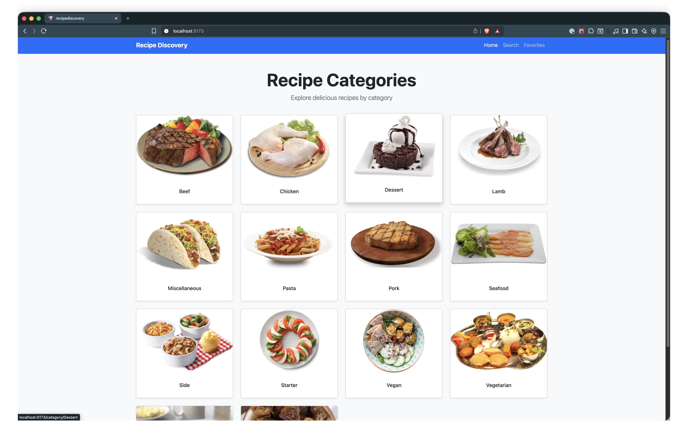
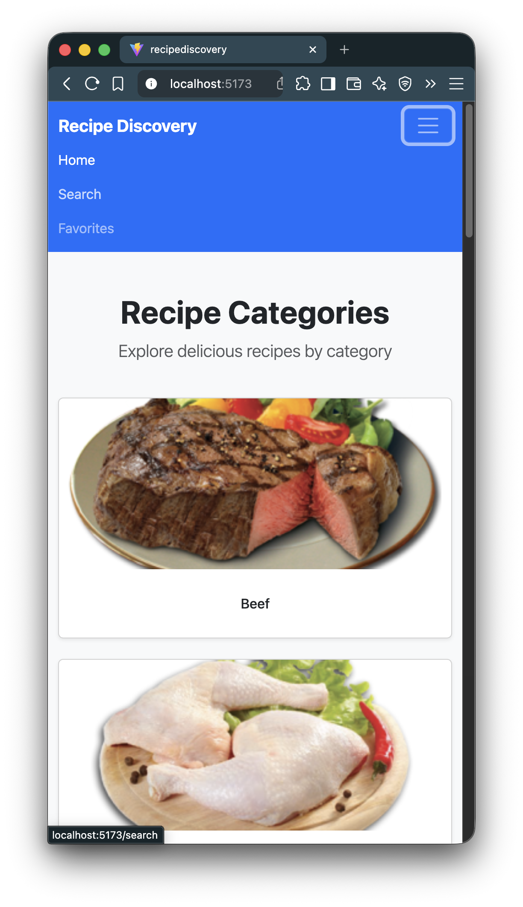

# 🍽️ Recipe Discovery – React + TypeScript App

A clean and responsive **Recipe Discovery** single-page application built with **React**, **TypeScript**, **Bootstrap**, and the **TheMealDB API**.
Users can browse recipes by category, search for meals, view detailed recipe information, and manage a personal list of favorite recipes that persist across sessions.

---

## 🎯 Project Objectives

The goal of this project is to demonstrate mastery of **advanced React concepts** including:

-   Custom hooks
-   Context API for global state
-   Client-side routing with dynamic routes
-   Type-safe API integration using TypeScript
-   Persistent state using Local Storage

This project focuses on **clarity, structure, and scalability**, following best practices for modern React applications.

---

## 🧩 Users Can:

-   **Browse recipe categories** provided by TheMealDB
-   **View meals by category**
-   **Search for recipes by name**
-   **View detailed recipe information**, including ingredients and instructions
-   **Add and remove favorite recipes**
-   **Persist favorites** using Local Storage
-   **Navigate seamlessly** using client-side routing
-   **Receive clear loading and error feedback**

---

## 🚀 Live Demo

> 🌐 **Live Demo:** [Click Here for Live Demo](https://dapper-dodol-9583ee.netlify.app/)

> 💻 **Repository:** [View Source on GitHub](https://github.com/structbase/RecipeDiscovery)

---

## 📸 Screenshots

### 🖥️ Desktop Layout



### 📱 Mobile Layout



---

## 📌 Features

### ✔ Category Browsing

Fetches and displays all available meal categories from TheMealDB API.

### ✔ Dynamic Routing

Includes dynamic routes for:

-   `/category/:categoryName`
-   `/recipe/:recipeId`
-   `/search?query=term`

### ✔ Recipe Search

Search for meals by name with results synced to the URL using query parameters.

### ✔ Recipe Details Page

Displays full recipe information including:

-   Image
-   Category
-   Area
-   Ingredients & measures
-   Cooking instructions

### ✔ Favorites System (Context API)

-   Add or remove meals from favorites
-   Favorites persist using Local Storage
-   Accessible globally across the app

### ✔ Reusable Components

-   `MealCard` - Displays meal thumbnails with images and titles
-   `Navbar` - Responsive navigation with active route highlighting
-   `Spinner` - Loading indicator component
-   `ErrorMessage` - Error display component

### ✔ Type-Safe Codebase

Strong typing for API responses, components, hooks, and context logic using TypeScript.

---

## 🛠️ Built With

-   **React 19** - UI library
-   **TypeScript** - Type-safe JavaScript
-   **React Router v7** - Client-side routing
-   **Bootstrap 5.3** - CSS framework for responsive design
-   **Vite** - Build tool and dev server
-   **Custom Hooks** - Reusable data fetching and state management
-   **Context API** - Global state management
-   **TheMealDB API** - Recipe data source
-   **Local Storage** - Persistent favorites storage

---

## 🌐 API Used

**TheMealDB (Free Public API)**
No API key required.

Example endpoints used:

-   Categories: `/categories.php`
-   Filter by category: `/filter.php?c=Seafood`
-   Recipe details: `/lookup.php?i=52772`
-   Search: `/search.php?s=Arrabiata`

---

## 📂 Folder Structure

```
RecipeDiscovery/
├── README.md
├── eslint.config.js
├── index.html
├── package-lock.json
├── package.json
├── public
│   └── screenshots
│       ├── desktop.png
│       └── mobile.png
├── src
│   ├── App.css
│   ├── App.tsx
│   ├── components
│   │   ├── ErrorMessage.tsx
│   │   ├── MealCard.tsx
│   │   ├── Navbar.tsx
│   │   └── Spinner.tsx
│   ├── context
│   │   └── FavoritesContext.tsx
│   ├── hooks
│   │   ├── useFetch.ts
│   │   └── useLocalStorage.ts
│   ├── index.css
│   ├── main.tsx
│   ├── pages
│   │   ├── Category.tsx
│   │   ├── Favorites.tsx
│   │   ├── Home.tsx
│   │   ├── NotFound.tsx
│   │   ├── RecipeDetail.tsx
│   │   └── Search.tsx
│   └── types
│       ├── api.ts
│       ├── category.ts
│       ├── errorMessage.ts
│       ├── favorites.ts
│       └── meal.ts
├── tsconfig.app.json
├── tsconfig.json
├── tsconfig.node.json
└── vite.config.ts

9 directories, 33 files
```

---

## 🚀 Getting Started

### **1️⃣ Clone the repository**

```bash
git clone https://github.com/structbase/RecipeDiscovery
```

### **2️⃣ Install dependencies**

```bash
npm install
```

### **3️⃣ Run the development server**

```bash
npm run dev
```

The app will be available at `http://localhost:5173`

### **4️⃣ Build for production**

```bash
npm run build
```

### **5️⃣ Preview production build**

```bash
npm run preview
```

---

## 🧠 How It Works

### ➡ Generic Data Fetching Hook

```ts
const { data, loading, error } = useFetch<CategoriesResponse>(API_URL);
```

Handles:

-   Loading state
-   Error handling
-   AbortController cleanup
-   Generic typing for reuse

---

### ➡ Favorites with Context + Local Storage

```ts
const { favorites, addFavorite, removeFavorite } = useFavorites();
```

Favorites are:

-   Stored globally using Context API
-   Persisted using a custom `useLocalStorage` hook

---

### ➡ URL-Based Search State

```ts
/search?query=chicken
```

Search state is synced with the URL, allowing:

-   Bookmarkable searches
-   Page refresh persistence
-   Clean navigation behavior

---

## 📣 Acknowledgements, Credits & Resources

### 🍽️ API Provider

-   [**TheMealDB API** – Free public recipe API](https://www.themealdb.com/api.php)

### 📘 Documentation

-   [**MDN Web Docs** – Fetch API, Local Storage, AbortController ](https://developer.mozilla.org/)
-   [**React Documentation** ](https://react.dev/)
-   [**React Router Documentation** ](https://reactrouter.com/)
-   [**TypeScript Handbook** ](https://www.typescriptlang.org/docs/)

### 🎥 Learning Resources

-   [**PedroTech – Custom Hooks & useFetch Patterns**](https://www.youtube.com/@PedroTechnologies)
-   [**Web Dev Simplified – React Patterns & Best Practices** ](https://www.youtube.com/@WebDevSimplified)
-   [**Academind – React & TypeScript Deep Dives** ](https://www.youtube.com/@academind)

### 🏫 Course Materials

-   [**PS-IMP Vercel – useState & useEffect**](https://ps-lms.vercel.app/curriculum/se/416/lesson-1)
-   [**PS-IMP Vercel – useEffect Patterns**](https://ps-lms.vercel.app/curriculum/se/416/lesson-2)
-   [**PS-IMP Vercel – Advanced Custom Hooks**](https://ps-lms.vercel.app/curriculum/se/416/lesson-4)
-   [**PS-IMP Vercel – Context API**](https://ps-lms.vercel.app/curriculum/se/416/lesson-5)

---

## 📝 Reflection

The most challenging part of this project was **structuring the application cleanly while introducing TypeScript**. Defining accurate API response types and ensuring consistency across hooks, pages, and components required careful planning.

A key design decision was creating a **generic `useFetch<T>` hook** instead of duplicating fetch logic in every page. This improved reusability, simplified error handling, and kept components focused on rendering rather than data management.

Using the **Context API for favorites** allowed the favorites feature to scale cleanly across multiple pages without prop drilling, while Local Storage ensured persistence across sessions.

**Bootstrap integration** was added to provide a consistent, responsive design system across all pages, reducing custom CSS maintenance and ensuring mobile-first responsiveness.

---

## ✍️ Author

Developed by **Abenezer**

> Junior Front-End Developer
> Focused on React, TypeScript, and clean UI architecture

---
